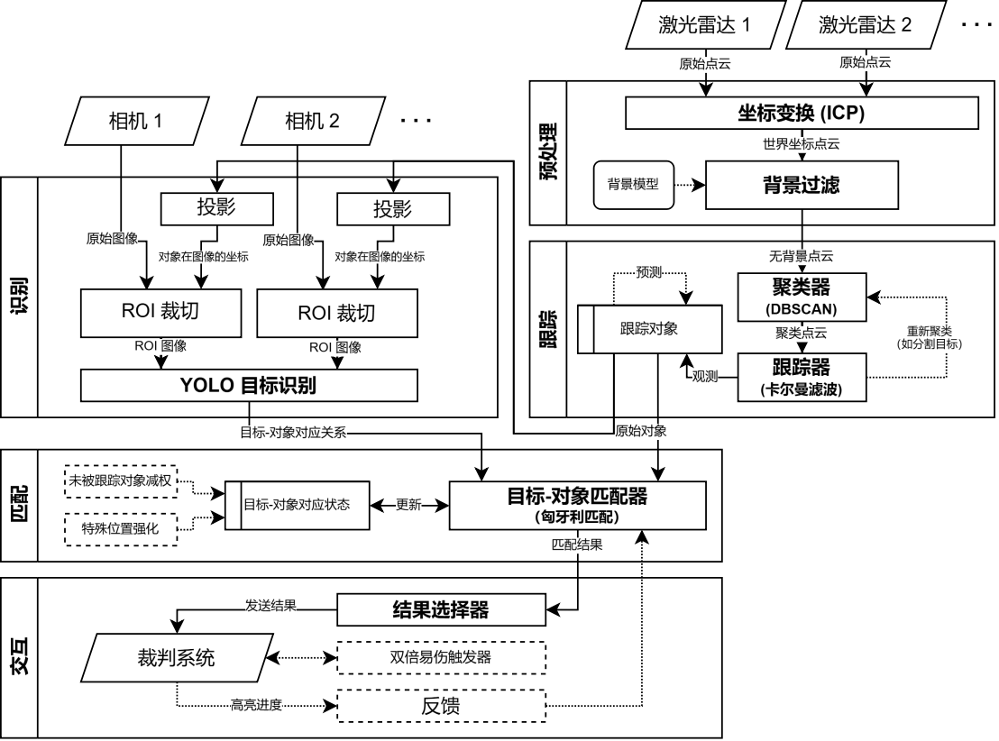

# 南工骁鹰雷达站工作空间

RoboMaster 2024 哈尔滨工业大学（深圳） 南工骁鹰战队 雷达站 完整开源

*开源仓促，文档不够完善，还请见谅！*

## 各包功能

```plaintext
livox_v1_lidar      激光雷达驱动（Livox Mid-70）
livox_v2_lidar      激光雷达驱动（Livox HAP）
pc_aligner          点云配准
pc_detector         点云聚类分割

hik_camera          海康相机驱动
img_recognizer      视觉识别
nn_detector         神经网络推理

target_matcher      聚类-识别匹配
judge_bridge        裁判系统驱动
dv_trigger          双倍易伤触发
target_multiplexer  目标选择器（国赛改协议前）

radar_bringup       Launch 文件存放
radar_interface     协议
radar_utils         实用工具

target_visualizer   聚类目标可视化
result_visualizer   匹配结果可视化
radar_supervisor    状态监控
```

参考结构：



## 部署指南

目标平台： Ubuntu 22.04 (Jammy Jellyfish) + ROS 2 (Humble)

### 依赖安装

请参考 ROS 文档使用 `rosdep` 安装。其中有少部分依赖无法自动安装，请手动补全。

<https://docs.ros.org/en/humble/Tutorials/Intermediate/Rosdep.html#rosdep-operation>

### 编译

最简单的编译方式为：

```bash
# 在 Workspace 根目录下
colcon build
```

为了方便在 VSCode 上进行开发，我们在 `.vscode/tasks.json` 中预置了大量的编译命令，可直接执行。

### 运行

利用 `radar_bringup` 中的 Launch 文件一键运行。

```bash
source ./install/setup.bash
ros2 launch radar_bringup 24_national.launch.py
```

## 未来方向

- 点云聚类能力优化，提升抗遮挡、抗误合并能力
- 多模态融合，以得到更好的感知能力
- 部署自动化，减少人力消耗
- 单元测试，减少 Bug 的产生
- 与自动兵种紧密结合

---

本项目以 Mozilla Public License 2.0 授权
